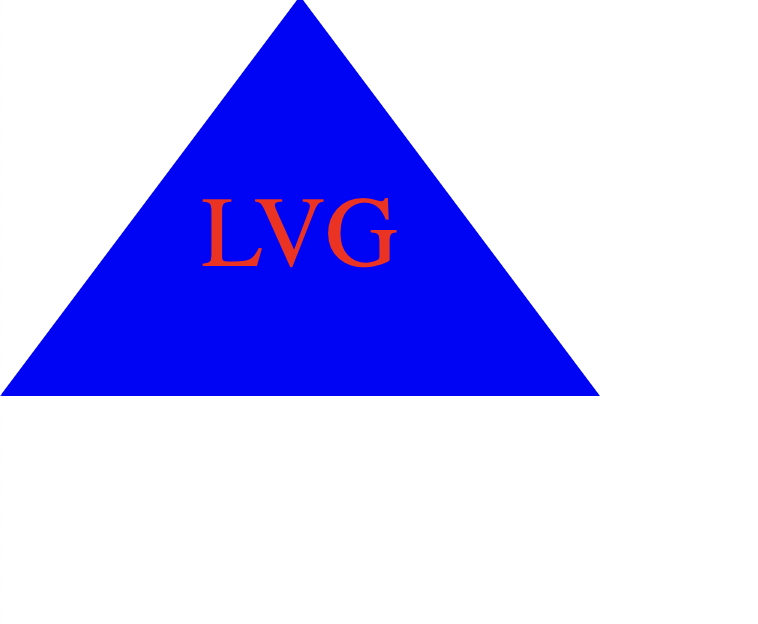

## Description

This application allows web developers to build simple logos for their projects. It uses inquirer to prompt the user about the logo's shape, text color, shape color, and to enter up to three characters that will be displayed within the logo. When the prompts are answered, an svg file is generated that can be opened on a new webpage containing the logo with each request. The code utilizes one test suite with three tests to ensure the proper shapes, colors, and texts are generated. Thanks to doing this project, I learned how to unit test. Future developments could expand the color and shape range of the logos. 

## Installation

1. Clone the repo, then open in VSCode.
2. Install NodeJS
3. Run 'npm i inquirer@8.0.0' in Terminal to install inquirer. Newer versions may give errors
4. 'npm install --save-dev jest' to install Jest.
5. Your package.json file should look like this:
`{
    "dependencies": {

    "inquirer": "^8.0.0"

  },
  "scripts": {
    "test": "jest"
  },
  "devDependencies": {
    "jest": "^29.7.0"
  }
}
`
6. Run npm test to see if your shape tests pass.
7. Run the application by right clicking on index.js, click Run in Integrated Terminal, then run node index.js

## Credits

wazimu's SVG Logo Tutorial https://www.youtube.com/watch?v=N7cJc8cgQYg 

## Walkthrough

https://drive.google.com/file/d/1CHy-76jkP1Usz_9NzNQXatMRPd5Lh6Z2/view?usp=sharing

## Example 

